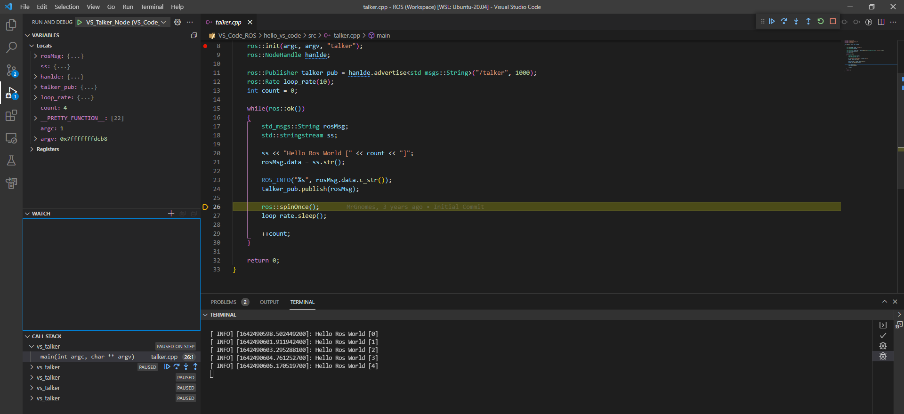
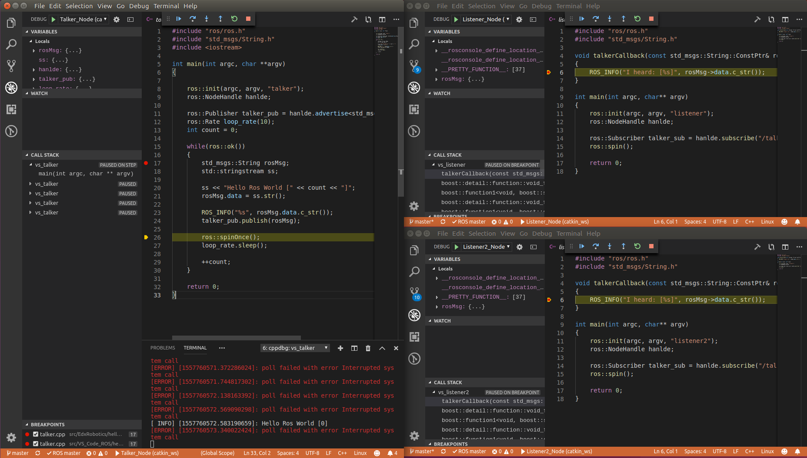
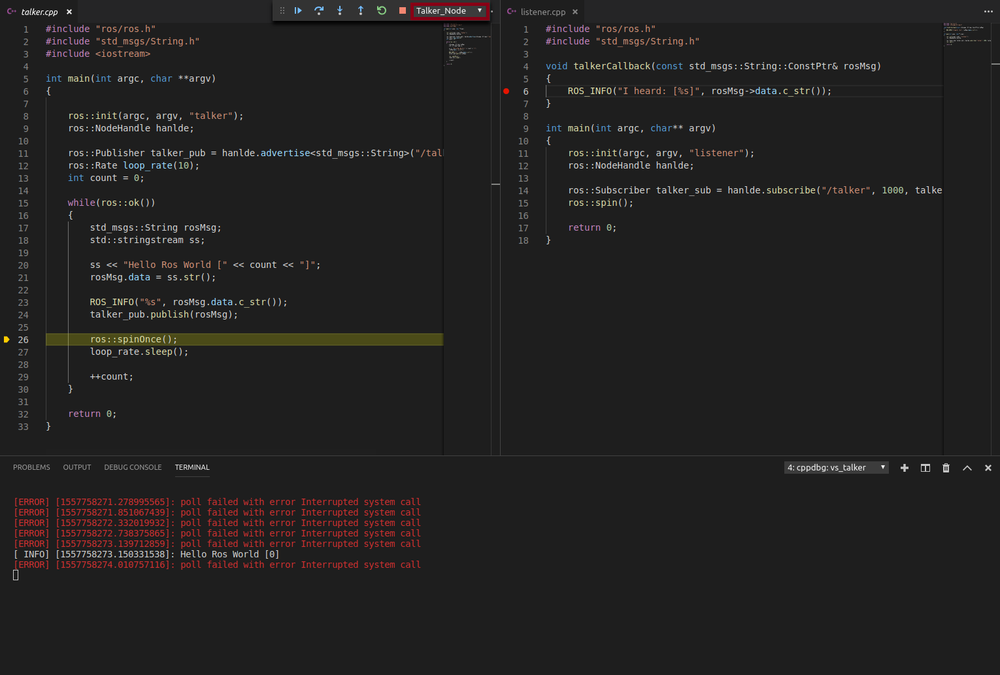
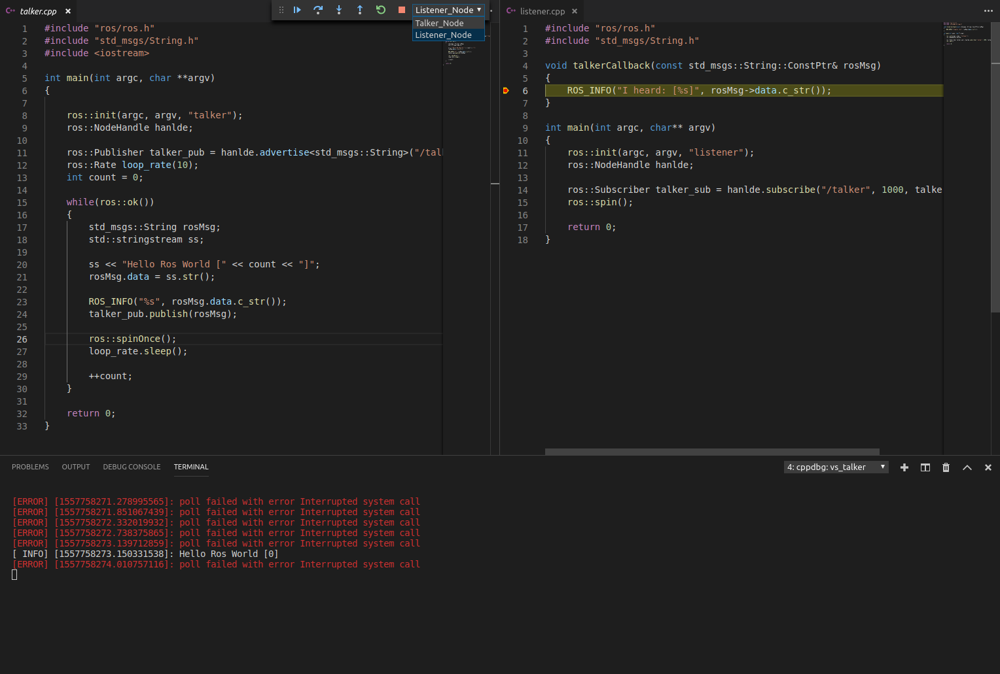
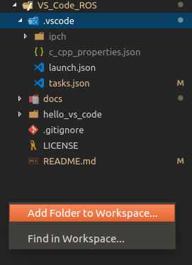
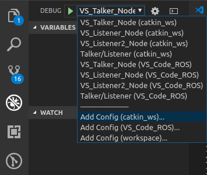

# Step By Step Integration of ROS in VS Code

This repository provides an example set up that can be used to automate your ROS workflow in the VS Code IDE.


## Contents:
* [1. VS Code Extensions](#1-vs-code-extensions)
* [2. Set Up your VS Code Workspace](#2-set-up-your-vs-code-workspace)
* [3. Intellisense](#3-intellisense)
* [4. Create your Package](#4-create-your-package)
* [5. Building Your Nodes](#5-building-your-nodes)
* [6. Debugging Your Nodes](#6-debugging-your-nodes)
* [7. Multi-Root ROS Workspace](#7-multi-root-ros-workspace)

## 1) VS Code Extensions

I use the following extensions:

- C/C++ (c++ intellisense and configuration help) -> Mandatory
- Clangd (Alternative intellisense provider. C/C++ intellisense needs to be disabled for this one to work) -> Optional
- CMake (Intellisense support in CMakeLists.txt files) -> Optional
- GitLens (Git support and additional git tab) -> Optional
- Python (If you're using rospy) -> Mandatory
- vscode-icons (Optional, but helps with all the different file types used by ROS) -> Optional
- ROS (Adds helper actions for starting the roscore, for creating ROS packages and provides syntax highlighting for .msg, .urdf and other ROS files) -> Mandatory (Needed for the catkin_make task type)
 
If you clone this repo, then VS Code will ask you if you want to install the recommended extensions.

### GitLens has a problem with git versions <= 2.7. Update git on Ubuntu 16.04

```
sudo apt-get install python-software-properties software-properties-common
sudo add-apt-repository ppa:git-core/ppa -y
sudo apt-get update
sudo apt-get upgrade
sudo apt-get install git -y
```

Check with `git --version` that the newly installed version is > 2.7.

## 2) Set Up your VS Code Workspace 

### Install ROS

If you haven't installed ROS yet, then install it now.
Here is the official documentation for ROS noetic for Ubuntu: http://wiki.ros.org/noetic/Installation/Ubuntu

Here's a quick wrap up (tested on Windows 11 with WSL2 - Ubuntu Distro):
```
$ sudo sh -c 'echo "deb http://packages.ros.org/ros/ubuntu $(lsb_release -sc) main" > /etc/apt/sources.list.d/ros-latest.list'
$ curl -s https://raw.githubusercontent.com/ros/rosdistro/master/ros.asc | sudo apt-key add -
$ sudo apt update
$ sudo apt install ros-noetic-desktop-full
$ echo "source /opt/ros/noetic/setup.bash" >> ~/.bashrc
$ source ~/.bashrc
$ sudo apt install python3-rosdep python3-rosinstall python3-rosinstall-generator python3-wstool build-essential
$ sudo apt install python3-rosdep
$ sudo rosdep init
$ rosdep update
$ mkdir -p ~/catkin_ws/src
$ cd ~/catkin_ws/
$ catkin_make
```

### Set Up the VS Code Workspace

Assuming your catkin workspace is all set up and running smoothly, we need to tell VS Code where our ROS workspace is.
This can be accomplished in two ways:
1) Open the catkin root folder in VS Code and use the complete catkin folder as your workspace.
    This is a centralized ROS package management approach, where you get to see every ROS package and where you have to manage your configurations
    globally for every package. Meaning one launch.json and one task.json for everything.
    This is the most common approach seen on the web.
2) Use the multi-root option VS Code provides to manage each ROS package as a single project and provide individual
    build, debug and other run tasks that are common on a package level.
    You can then add each ROS package folder to your workspace (each with it's individual configurations) and VS Code
    will find all your launch.json and task.json files.
    When you search for a launch or a build configuration, VS Code will also add the name of the ROS package folder to your label
    as a suffix, so you can find the configuration based on the package name.
    I personally like this approach more, because of the nice clean separation of build and debugging tasks between my packages and because this essentially make every ROS package self contained. 

But first let's try the first approach and build/debug a package from a centralized configuration, since it is easier to start with.

Start a VS Code instance, open the catkin_ws workspace folder and go to "File>Save Workspace As" and save the workspace file in your catkin root.
This should add the {workspaceName}.code-workspace file and a .vscode folder to your catkin_ws root folder.  
You should now have the following (or a similar) folder structure:
```
~/catkin_ws
    .vscode/
    build/
    devel/
    src/
    ROS_WS.code-workspace
```

## 3) Intellisense

### C/C++ Extension

To add intellisense support for ROS nodes, we need to provide a c_cpp_properties.json in our .vscode folder.
This is used by the C/C++ Extension to provide autocompletion.
For this to work, one piece is still missing. It needs to know about te project dependencies and where to find them. 
CMake is able to provide this info through the help of a compile_commands.json file.
The generate this file, we need to add the "-DCMAKE_EXPORT_COMPILE_COMMANDS=1" compile option to catkin_make.
Section 5 explains how we can automate the creation of the file through the use of vscode tasks.  


c_cpp_properties.json
```
{
    "configurations": [
        {
            "name": "Linux",
            "intelliSenseMode": "gcc-x64",
            "compilerPath": "/usr/bin/g++",
            "cStandard": "c11",
            "cppStandard": "c++17"
            "compileCommands": "${workspaceFolder}/build/compile_commands.json"
        }
    ],
    "version": 4
}
```

### Clangd Extension

VSCode has another option to provide intellisense for C++ code.
You could use the clangd extension that comes with support for the clang compiler.
In my opinion, the intellisense is better and provides some neat extra functions
like find all references.
But it is more of a hassle to set up.

For this to work, you need to install the clangd extension and install the 
clangd language server that the extension prompts you to.
After the disable the C/C++ extension intellisense
and tell the clangd extension where to find the compile_commands.json.
Open up your global vs code user settings and paste this:
```
"clangd.arguments": [
    "--compile-commands-dir=${workspaceFolder}/build",
    "--completion-style=detailed",
    "--clang-tidy",
    "--clang-tidy-checks=-*,modernize*",
    "--header-insertion=never"
],
"C_Cpp.intelliSenseEngine": "Disabled",
```

This should set up clangd as a intellisense provider for all your project.
If you only want to activate it for this workspace, you could add a settings.json file to your
catkin workspace inside the centralized .vscode folder.
But you will still build and debug using the C/C++ extension.

## 4) Create Your Package
TBD

## 5) Building Your Nodes

You should now have a VS Code workspace set up in your catkin workspace root.

The easiest way is to use the build task provided by the ROS extension named:
catkin_make: build.
You can run `CTRL+SHIFT+P`, search for "Tasks: Run Task" and select the "ROS: catkin_make: build" task.
But that task comes without the compile_commands.json file needed for
intellisense to work.

We add our own build task configuration.
Add the following task.json to the folder ~/catkin_ws/.vscode:
```
{
    "version": "2.0.0",
    "tasks": [
        {
            "label": "ROS: central_catkin_make",
            "type": "catkin_make",
            "args": [
                "--directory",
				"<path-to-your-catkin-ws>/catkin_ws",
                "-j4",
                "-DCMAKE_BUILD_TYPE=Debug",
                "-DCMAKE_EXPORT_COMPILE_COMMANDS=1"
            ],
            "problemMatcher": "$catkin-gcc",
            "group": {
                "kind": "build",
                "isDefault": true
            }
        }
    ]
}
```

You can now run `CTRL+SHIFT+P`, search for "Tasks: Run Task" and select the "ROS: catkin_make" task we configured. Since we set it to be the default build task with the `group` option you can also run that task with the shortcut `CTRL+SHIFT+B`. 
The build type is set to "Debug", so that the ROS nodes can be debugged later on.

You can add your own additional configurations and run them with the "Run Task" action, or provide your own keybindings for your own build configurations.
Check out the VS Code documentation for more information on that.

If your ROS workspace contains a lot of packages you may not want to build them all.
You can add these additional parameters to the task for that:
```
{
    "version": "2.0.0",
    "tasks": [
        {
            "label": "ROS: central_catkin_make",
            "type": "catkin_make",
            "args": [
                "--directory",
				"<path-to-your-catkin-ws>/catkin_ws",
                "--pkg",
                "<your package name, e.g. hello_vs_code>",
                "-j4",
                "-DCMAKE_BUILD_TYPE=Debug",
                "-DCMAKE_EXPORT_COMPILE_COMMANDS=1"
            ],
            "problemMatcher": "$catkin-gcc",
            "group": {
                "kind": "build",
                "isDefault": true
            }
        }
    ]
}
```
Note that catkin will still be configuring every package in the catkin-ws, but it will only build the specified one.
You can check this by inspecting the ~/catkin_ws/devel/lib/**packagename** folder.

## 6) Debugging Your Nodes

Setting up a working debugging session is pretty straight forward with VS Code.
I'll show you how to debug a single node first and build upon that to configure a multi-node debugging set up.

The following sections assume you have a hello_vs_code package in your  ~/catkin_ws/src folder, with three nodes: talker.cpp, listener.cpp, listener2.cpp, and that you built the packages.
You can also clone this repo and build the package I am providing here.

### Debug a Single ROS Node with VS Code (C++)

Add a launch configuration (launch.json) to the .vscode folder in the catkin_ws and paste this to debug the talker node.

launch.json
```
{
    // Use IntelliSense to learn about possible attributes.
    // Hover to view descriptions of existing attributes.
    // For more information, visit: https://go.microsoft.com/fwlink/?linkid=830387
    "version": "0.2.0",
    "configurations": [
        {
            "name": "(gdb) Launch",
            "type": "cppdbg",
            "request": "launch",
            "program": "${workspaceFolder}/devel/lib/hello_vs_code/vs_talker",
            "args": [],
            "stopAtEntry": false,
            "cwd": "${workspaceFolder}",
            "environment": [],
            "externalConsole": false,
            "MIMode": "gdb",
            "setupCommands": [
                {
                    "description": "Enable pretty-printing for gdb",
                    "text": "-enable-pretty-printing",
                    "ignoreFailures": true
                }
            ]
        }
    ]
}
```
If you're using your own package, you have to change the path in the `program` option to point to your executable.
Unfortunatly I haven't found a way to generate this automatically based on the catkin build system outputs.
Maybe it's possible by using roslaunch and then attach to the active node. 
The ${worksspaceFolder} is the top level folder of your workspace (in this case it's catkin_ws).
If your ${workspaceFolder} isn't the catkin root, then you also need to change the `cwd` option to point to your catkin root folder.
More on that when we're setting up the multi-root workspace.

Set a breakpoint in your node file you want to debug (e.g. talker.cpp).
Start the roscore by using the ROS extension.
For that type `CTRL+SHIFT+P` and search for "ROS: Start Core" and check at the status bar that the ROS master is running. 
You can also open up a terminal and type in `roscore`.

Press F5 to launch the debugging session and make sure that you build
with the `-DCMAKE_BUILD_TYPE=Debug` option.
If you used the task.json example given in this guide, then you should be fine.

After that you can step through your node like in the example below:



The "`poll failed with ...`" error message is due to a bug in
the current ros_comm module. See issue [#1370][i1370] for updates.

### Debug Multiple ROS Nodes with VS Code (C++)

Since ROS uses the publisher/subscriber and request/response models, it's usually more interresting to debug multiple nodes that are interconnected through the ROS master.
The `configurations` option in the launch.json shown above is actually an array. 
You add multiple debug configurations by adding them to it.
But how do you use these configurations to actually start multiple debugging sessions?

There are currently three ways (known to me):

1) Open up a new VS Code window and select a configuration to be used by the new window and start the debugger.
2) Switch to the debug tab and select a configuration from the combo box, and start 
every configuration by hand.
3) Use an additional `compounds` option and start multiple configuration simultaniously.

So lets get those up and running and see whats possible.

#### The Separate Window Approach (recommended)

The obvious thing to try, would be to just open up a new window and open the workspace we already set up (using the vscode workspace file).
Unfortunatly this isn't (currently) possible.
The next thing to try would be to have the **worspace** open in one VS Code instance and than open up another instance and tell VS Code to open the catkin root folder directly and not using the workspace file. 
Both are pointing to same folder, but internally VS Code treats them differently.
This works, but you can't open the catkin root folder more than once (at least I couldn't).
So you're left with debugging a maximum of two nodes.

The approach that worked for me, was presented in [#19793](i19793):

- Launch a new VS Code window
- Use the "Add Workspace Folder" action 
  
  

- Select the catkin root folder (in my case catkin_ws), or in a multi-root setup select the ROS package folder you wan't to debug
- Switch to the debug tab. VS Code automatically detects all launch configurations inside your new workspace
- Set your breakpoints, select a configuration and start debugging
- Repeat for every node you want to debug

Below is an example where I am debugging three different nodes. A talker node that publishes to two subscribed listener nodes.
You can see that I was stepping through the talker node in the left window and as soon
as I moved past the `talker_pub.publish(...)` line, the breakpoint hit on
both of VS Code instances on the right, that had active debugging sessions for the listener nodes. 
 

Combine this with the great intellisense provided and you have an incredibly powerfull tool at your hand for programming ROS nodes, which makes VS Code my go to IDE when I am working on any robotics stuff.

Here are a couple of points I like about the multi-window approach:

- Every window handles just one debugging session, getting a full responsive workflow
- I can choose which nodes to debug, and the visual separation helps me to keep track of where every node currently is and what it is doing
- I get a seperate local variable watch window for every node
- I can leave every window open as long as I want, while all my breakpoints are preserved. I can edit every file from any window and VS Code keeps track of everything

The downside is that this approach is consuming more window space, which can 
get cluttered on a single monitor set up.

Here is the complete launch.json and the tasks.json used for the global set up:
```
{
    // Use IntelliSense to learn about possible attributes.
    // Hover to view descriptions of existing attributes.
    // For more information, visit: https://go.microsoft.com/fwlink/?linkid=830387
        // Use IntelliSense to learn about possible attributes.
        // Hover to view descriptions of existing attributes.
        // For more information, visit: https://go.microsoft.com/fwlink/?linkid=830387
        "configurations": [
            {
                "name": "Talker_Node",
                "type": "cppdbg",
                "request": "launch",
                "program": "${workspaceFolder}/devel/lib/hello_vs_code/vs_talker",
                "args": [],
                "stopAtEntry": false,
                "cwd": "${workspaceFolder}",
                "environment": [],
                "externalConsole": false,
                "MIMode": "gdb",
                "setupCommands": [
                    {
                        "description": "Enable pretty-printing for gdb",
                        "text": "-enable-pretty-printing",
                        "ignoreFailures": true
                    }
                ]
            },
            {
                "name": "Listener_Node",
                "type": "cppdbg",
                "request": "launch",
                "program": "${workspaceFolder}/devel/lib/hello_vs_code/vs_listener",
                "args": [],
                "stopAtEntry": false,
                "cwd": "${workspaceFolder}",
                "environment": [],
                "externalConsole": false,
                "MIMode": "gdb",
                "setupCommands": [
                    {
                        "description": "Enable pretty-printing for gdb",
                        "text": "-enable-pretty-printing",
                        "ignoreFailures": true
                    }
                ]
            },
            {
                "name": "Listener2_Node",
                "type": "cppdbg",
                "request": "launch",
                "program": "${workspaceFolder}/devel/lib/hello_vs_code/vs_listener2",
                "args": [],
                "stopAtEntry": false,
                "cwd": "${workspaceFolder}",
                "environment": [],
                "externalConsole": false,
                "MIMode": "gdb",
                "setupCommands": [
                    {
                        "description": "Enable pretty-printing for gdb",
                        "text": "-enable-pretty-printing",
                        "ignoreFailures": true
                    }
                ]
            }
        ],
         "compounds": [
            {
                "name": "Talker/Listener",
                "configurations": ["Talker_Node", "Listener_Node"]
            }
        ]
}
```
task.json
```
{
    "version": "2.0.0",
    "tasks": [
        {
            "label": "ROS: catkin_make",
            "type": "shell",
            "command": "catkin_make",
            "args": [
                "--pkg",
                "hello_vs_code",
                "-j4",
                "-DCMAKE_BUILD_TYPE=Debug",
            ],
            "problemMatcher": [],
            "group": {
                "kind": "build",
                "isDefault": true 
            }
        }
    ]
}
```

#### The Compound Approach 

VS Code can launch multiple debug configuration from the same window, you just need to define them (we'll be using the ones defined above).
Switch to the debug tab, set your breakpoints, select a configuration and start it.
To start another one, just select another configuration from the combo box and start it. It's pretty much that easy.

By starting more than one debugging session, the debug toolbar changes and it adds a combo box that allows you to select the active session you currently want to view.
This basically means that you can only view the breakpoints and step through the code of the session that is currently selected in the combo box.

You can also add the `compounds` option to your launch configuration and start as many debug sessions simultaneously as you want, but you can still only view the breakpoints of the one that is selected.
You also need to close every debugging session individually when you want to stop debugging and you need to do it for every debug configuration you included in the compounds option.

In the example below I started the talker and the listener configuration and stepped through the talker code until I 
passed the `talker_pub.publish(...)` code. 
Notice that I switched the active session to the "Talker_Node" in the debugger tool bar and that I don't see
the breakpoint beeing hit in the listener window on the right side.
  


Now VS Code does a pretty good job switching automatically the session where a breakpoint was hit
(see the image below).
This also aplies to the multi-window approach.
VS-Code automatically switches the window to the one where a breakpoint was hit.


The one thing I personally don't like, is that as soon as I step through the listener callback, the program returns to the ROS spin thread and then VS Code stays in the "Listener_Node" debug session, leaving me to manually select the talker node, to be able to step through the original node I debugged.

This is obviously just a matter of personal preference, but I like having the yellow bar as a visual feedback to know where every node is (see the image in the windowed section).
And I don't like stepping through every configuration to get back to the previous one.
This gets even worse as the number of nodes in your workspace increases, altough VS Code provides you with means to search for a debug configuration by name.
But it's still more annoying (to me) than to just have the debug session for a particular node always active in it's own window.

## 6) Multi-Root ROS Workspace

Ok so now we have a global task.json, launch.json and c_cpp_properties.json sitting in our catkin root folder.
Since it is local, we don't disturbe any settings of other users when publishing the package.
But it also means we have to write every configuration in this single file.
This tends to get annoying, as the number of packages and nodes increases. 

The first thing one might try, is to add local files in the package itself and hope that VS Code finds it.
Currently VS Code does not search recursively for *.json files in sub folders.
But it does find them multi-root workspaces.
So we could add a local .vscode folder to every package and create a workspace where we add every ROS package as a folder to the workspace.
As said, VS Code supports that and it is the (currently) recommended way to create a multi-root workspace in VS Code.

It's actually possible to have the catkin_ws folder as a separate folder to your workspace,
combined with the child folders of your ROS packages.
So it seems that there would be no drawback to this method, since you get the best of both worlds (self contained ROS packages and the overall view of your build environment).
But as always in life, there is a catch.

There seems to be bug currently in VS Code. 
When adding a parent folder and it's child folder to a workspace the intellisense engine seems to break.

But there is a solution to that too.
It only breaks when you first add the parent folder and then it's child.
Or to be more exact, when the parent folder sits above the child folder in the directoy listing of your workspace folder.
It seems that the intellisense indexer traverses the folder in the order we add them to the workspace.
If for example you start a fresh VS Code instance and you add a ROS package (e.g. VS_Code_ROS) as a folder to your workspace and then add the catkin_ws folder as **the last** folder to your workspace, everything works as expected.
If you do it the other way around, then intellisense breaks in the child folder.
Actually  you can just move the catkin_ws folder to the last position in the explorer tab and most of the time it works again.
But the most reliable (and fastest way) is to remove the catkin_ws folder and readd it, after you added all your child folders to the workspace. 

So here is my working set up:

- First remove the catkin_ws folder, leaving you with an empty workspace
- Add all the ROS packages you want as additional folders to the workspace, using the context menu when right clicking the explorer tab (see image below). Since the VS Code workspace is only a logical construct, it doesn't create a copy of your files or does something else with them.
It's more like a direct link to your specific ROS package, without any noise from any parent directory.
Here is an example workspace with only the VS_Code_ROS package added:  

- Add a .vscode folder at the package root folder. This enables VS Code to find the launch configuration for every folder you add to your workspace
- Add a taks.json, c_cpp_properties.json and launch.json configuration file to the .vscode folder and add your package specific configurations (see the .vscode folder in the VS_CODE_ROS package in the image above)
- Add your catkin_ws folder last.
    When adding new packages to your workspace, you need the remove and readd your catkin_ws folder 
- Since we now have multiple workspace folders in VS Code we need to tell it where to find our include folders, executables and where the catkin_ws root folder is.
  We can do this using relative paths.
  Remember the ${workspaceFolder} is now different for every folder you add to your workspace, because of the multi-root environment.
  If you need to debug the path for a package, you can add a 
  task to your tasks.json where you just set "dir" or "ls" as the command, change the "cwd" option and run the task until you get the right path you need.
  Here are the configrations for the shown package:
  
c_cpp_properties.json
```
{
    "configurations": [
        {
            "name": "Linux",
            "browse": {
                "databaseFilename": "",
                "limitSymbolsToIncludedHeaders": true
            },
            "includePath": [
                "${workspaceFolder}/../../devel/include",
                "/opt/ros/kinetic/include",
                "/usr/include/**",
                "${workspaceFolder}/**"
            ],
            "intelliSenseMode": "gcc-x64",
            "compilerPath": "/usr/bin/g++",
            "cStandard": "c11",
            "cppStandard": "c++17"
        }
    ],
    "version": 4
}
```

tasks.json
```
{
    "version": "2.0.0",
    "tasks": [
        {
            "label": "ROS: Build Hello_VS_CODE",
            "type": "shell",
            "command": "catkin_make",
            "args": [
                "--pkg",
                "hello_vs_code",
                "-j4",
                "-DCMAKE_BUILD_TYPE=Debug"
            ],
            "problemMatcher": [],
            "options": {
				"cwd": "${workspaceFolder}/../../"
			},
            "group": {
                "kind": "build",
                "isDefault": true
            }
        }
    ]
}
```

launch.json
```
{
    // Use IntelliSense to learn about possible attributes.
    // Hover to view descriptions of existing attributes.
    // For more information, visit: https://go.microsoft.com/fwlink/?linkid=830387
        // Use IntelliSense to learn about possible attributes.
        // Hover to view descriptions of existing attributes.
        // For more information, visit: https://go.microsoft.com/fwlink/?linkid=830387
        "configurations": [
            {
                "name": "VS_Talker_Node",
                "type": "cppdbg",
                "request": "launch",
                "program": "${workspaceFolder}/../../devel/lib/hello_vs_code/vs_talker",
                "args": [],
                "stopAtEntry": false,
                "cwd": "${workspaceFolder}/../../",
                "environment": [],
                "externalConsole": false,
                "MIMode": "gdb",
                "setupCommands": [
                    {
                        "description": "Enable pretty-printing for gdb",
                        "text": "-enable-pretty-printing",
                        "ignoreFailures": true
                    }
                ]
            },
            {
                "name": "VS_Listener_Node",
                "type": "cppdbg",
                "request": "launch",
                "program": "${workspaceFolder}/../../devel/lib/hello_vs_code/vs_listener",
                "args": [],
                "stopAtEntry": false,
                "cwd": "${workspaceFolder}/../../",
                "environment": [],
                "externalConsole": false,
                "MIMode": "gdb",
                "setupCommands": [
                    {
                        "description": "Enable pretty-printing for gdb",
                        "text": "-enable-pretty-printing",
                        "ignoreFailures": true
                    }
                ]
            },
            {
                "name": "VS_Listener2_Node",
                "type": "cppdbg",
                "request": "launch",
                "program": "${workspaceFolder}/../../devel/lib/hello_vs_code/vs_listener2",
                "args": [],
                "stopAtEntry": false,
                "cwd": "${workspaceFolder}/../../",
                "environment": [],
                "externalConsole": false,
                "MIMode": "gdb",
                "setupCommands": [
                    {
                        "description": "Enable pretty-printing for gdb",
                        "text": "-enable-pretty-printing",
                        "ignoreFailures": true
                    }
                ]
            }
        ],
        "compounds": [
            {
                "name": "Talker/Listener",
                "configurations": ["VS_Talker_Node", "VS_Listener_Node"]
            }
        ]
}
```
Since the packages are subfolders of the catkin_ws/src folder, VS Code keeps highlighting the files in the explorer tab that are also open in the editor. Most of the time it will unfold the complete catkin_ws folder in the explorer tab, to show you the file beeing edited. You can set the "explorer.autoReveal" option to false to tell VS Code to stop messing with the folders.

You now have a multi-root environment where every ROS package is completly self contained and you see the catkin_ws root folder. 
This gives you full intellisense, full build flexbility and the complete debug experience previously explained.
To debug multiple nodes/packages in a multi window set up, you just need to open a new window and add
the self-contained ROS packages you want to debug to your new (temporary) workspace (as described in the [Seperate Window Approach](#the-separate-window-approach-(recommended))).

I also use this "trick", when I want to focus on one single package. 
This gives me a clean look on this single folder, while still providing the full build and debugging experience.
You can always add and remove any package folder from your workspace without losing anything.
The only difference is the catkin_ws folder with the previuosly mentioned intellisene problem.


With this set up you also get a nice little suffix with the name of the package folder to your debugging launch configurations when you are in the debug tab.
I just copied the launch.json from the VS_CODE_ROS package to catkin_ws/.vscode to get this doubled output:



You can also add a package specific task.json and enable single package building and overriding the default build task.
Setting multiple default build tasks in a multi-root environment will force VS Code to show a searchable prompt when using the build shortcut `CTRL+SHIFT+B` and asking for a selection of the 
task that should be run.
Here is the example shown above of a package specific default build task that only builds the hello_vs_code package:
```
{
    "version": "2.0.0",
    "tasks": [
        {
            "label": "ROS: Build Hello_VS_CODE",
            "type": "shell",
            "command": "catkin_make",
            "args": [
                "--pkg",
                "hello_vs_code",
                "-j4",
                "-DCMAKE_BUILD_TYPE=Debug"
            ],
            "problemMatcher": [],
            "options": {
			    "cwd": "${workspaceFolder}/../../"
			},
            "group": {
                "kind": "build",
                "isDefault": true
            }
        }
    ]
}
```

You can add any other tasks specific to that package, like launching rviz or other plugins.
And then you can add those tasks as a preLaunchTask in your launch.json to start automatically with your debugging session when you hit F5.
Or you can add package specific keybindings to your package specific tasks, to enable a really fast workflow.


So have fun coding and debugging ROS nodes with VS Code.


 <!-- Links  -->
 
[i1370]: https://github.com/ros/ros_comm/issues/1370
[i19793]: https://github.com/Microsoft/vscode/issues/19793
[idebug]: https://vscode.readthedocs.io/en/latest/editor/debugging/
